# Informe Final del Trabajo Dirigido

## Modelo predictivo de atrasos y sobrecostos en contratos de obra pública del SECOP II Colombia, con prototipo de consulta inteligente

---

**Autor**: Ángel Garcia (angeldev07)
**Codirector**: Nelson Beltrán Galvis — C.C. 79.334.324 — nelsonbeltran@ufps.edu.co
**Período cubierto por el informe**: 16 de febrero – 21 de mayo de 2026
**Metodología**: CRISP-DM
**Repositorio**: `extraccion-datos/`

---

# Resumen ejecutivo

Este informe documenta el desarrollo completo del trabajo dirigido cuyo objetivo
general fue diseñar una metodología integral para el procesamiento y análisis
predictivo de contratos de obra pública en Colombia, mediante la integración de
datos heterogéneos provenientes del Sistema Electrónico para la Contratación
Pública (SECOP) y la aplicación de algoritmos de Aprendizaje Automático
(Machine Learning), con el fin de identificar tempranamente riesgos de
sobrecostos y retrasos en la ejecución contractual.

El proyecto integró seis fuentes de datos del portal datos.gov.co
(Contratos Electrónicos, Procesos de Contratación, Adiciones, Proveedores
Registrados, Proponentes por Proceso, Registro Único de Proponentes) y un
pipeline propio de extracción de indicadores financieros desde pliegos de
condiciones, consolidando un dataset analítico de **48.331 contratos únicos**
de obra pública con **152 variables predictoras** tras codificación e
imputación.

Sobre este dataset se entrenó un zoológico de **ocho algoritmos supervisados**
(Regresión Logística, K-Nearest Neighbors, Support Vector Machine, Random Forest,
XGBoost, LightGBM, Naive Bayes, Multi-Layer Perceptron) con calibración fina de
hiperparámetros mediante `RandomizedSearchCV` y validación cruzada estratificada
de cinco particiones. El modelo ganador, **LightGBM**, alcanzó un Área Bajo la
Curva ROC de **0,9091** sobre la predicción de atrasos en plazo y de **0,8338**
sobre la predicción de sobrecostos en el conjunto de prueba.

Finalmente, se construyó un **prototipo funcional de chatbot conversacional**
que utiliza el modelo predictivo como motor de inferencia, integrando el modelo
de lenguaje Gemini 2.5 Flash para la extracción de variables a partir de texto
libre y la humanización de la respuesta, con explicabilidad local mediante
valores SHAP.

Los cuatro objetivos específicos del proyecto se consideran cumplidos al cierre
del periodo. La metodología desarrollada es reproducible y los entregables —
datasets, modelos, código y documentación — quedan disponibles en el
repositorio para su consulta y eventual continuación de la investigación.

---

# Introducción

La contratación pública en Colombia constituye un pilar fundamental del
desarrollo socioeconómico del país, movilizando anualmente miles de millones de
pesos a través del Sistema Electrónico para la Contratación Pública (SECOP),
administrado por la Agencia Nacional de Contratación Pública — Colombia Compra
Eficiente (ANCP-CCE). Dentro de este ecosistema, los contratos de obra pública
representan el segmento de mayor envergadura presupuestal y, al mismo tiempo,
el más propenso a desviaciones significativas en costo y tiempo. Estudios
previos en el contexto colombiano señalan que hasta un 81,9 % de los proyectos
de infraestructura vial experimentan algún tipo de sobrecosto o atraso durante
su ejecución, lo cual evidencia la necesidad de transitar de esquemas de
auditoría reactiva hacia mecanismos de monitoreo preventivo basados en datos.

En este contexto, el presente trabajo dirigido se planteó como objetivo general
diseñar una metodología integral para el procesamiento y análisis predictivo de
contratos de obra pública mediante la integración de datos heterogéneos del
SECOP y la aplicación de algoritmos de aprendizaje automático, con el fin de
identificar tempranamente riesgos contractuales. Cuatro objetivos específicos
articularon el alcance del proyecto:

1. **Estructurar un proceso de Ingeniería de Datos (ETL)** que permita la
   extracción, limpieza y homologación semántica de los registros de obras
   civiles provenientes del SECOP, resolviendo inconsistencias de formato y
   calidad.
2. **Realizar un Análisis Exploratorio de Datos (EDA)** para caracterizar el
   comportamiento histórico de la contratación de infraestructura, identificando
   patrones, correlaciones y variables críticas asociadas a la eficiencia o
   ineficiencia administrativa.
3. **Desarrollar y validar modelos predictivos** basados en algoritmos
   supervisados (regresión/clasificación), orientados a estimar la probabilidad
   de ocurrencia de adiciones presupuestales o prórrogas en tiempo en los
   contratos analizados.
4. **Implementar un prototipo de interfaz de consulta inteligente** utilizando
   técnicas de modelos de lenguaje, que permita la interacción y la extracción
   de información predictiva mediante preguntas en lenguaje natural.

El documento se organiza en cuatro secciones principales que se corresponden
con los objetivos planteados. La Sección 1 describe el proceso de
identificación y extracción de los datos crudos del SECOP. La Sección 2
presenta el análisis estadístico y la caracterización del comportamiento
histórico de la contratación, con apoyo en visualizaciones. La Sección 3 detalla
la construcción del modelo predictivo, explicando las decisiones técnicas y la
justificación detrás de cada una de ellas. La Sección 4 documenta el desarrollo
del prototipo de chatbot conversacional que integra el modelo. El documento
cierra con un capítulo de conclusiones y anexos.

La metodología aplicada en todo el proyecto es **CRISP-DM** (Cross-Industry
Standard Process for Data Mining), un estándar industrial y académico que
organiza el ciclo de vida de un proyecto de minería de datos en seis fases
iterativas: comprensión del negocio, comprensión de los datos, preparación de
los datos, modelado, evaluación y despliegue. La selección de CRISP-DM responde
a tres criterios: su orientación al problema de negocio, su naturaleza
iterativa que permite retroceder entre fases cuando un hallazgo lo amerite, y
su condición de marco ampliamente adoptado que garantiza la reproducibilidad y
la comprensión por parte de futuros investigadores.

---

# Sección 1. Identificación y extracción de los datos crudos

## 1.1. El ecosistema de datos del SECOP

El Sistema Electrónico para la Contratación Pública (SECOP) publica, a través
del portal de datos abiertos del Gobierno de Colombia (`datos.gov.co`),
múltiples conjuntos de datos relacionados con la contratación estatal. Estos
datasets se exponen mediante la API SODA v3 (Socrata Open Data API) y permiten
consultas en SQL-like (SoQL) sobre la totalidad del histórico publicado.

Tras una revisión normativa y técnica del catálogo, se identificaron seis
fuentes oficiales relevantes para el análisis de contratos de obra pública:

| Fuente | Dataset ID | Nivel de información | Volumen aproximado |
|--------|------------|----------------------|--------------------|
| **Contratos Electrónicos** | `jbjy-vk9h` | Fuente madre del proyecto. Ciclo de vida completo del contrato firmado: identificación, entidad contratante, modalidad, fechas, valores, proveedor y estado de ejecución. | 51.353 registros de obra (87 columnas) |
| **Procesos de Contratación** | `p6dx-8zbt` | Pre-contrato: el proceso de compra antes de la firma. Aporta variables de competencia (oferentes, proveedores invitados, visualizaciones) libres de leakage temporal. | 138.112 registros (59 columnas) |
| **Adiciones contractuales** | `cb9c-h8sn` | Modificaciones al contrato durante su ejecución: adiciones de valor, prórrogas, suspensiones, cesiones, conclusiones anticipadas. | 249.037 registros (5 columnas) |
| **Proveedores Registrados** | `qmzu-gj57` | Perfil del proveedor: tipo, tamaño, ubicación, clasificación UNSPSC y antigüedad. | 13.117 proveedores (25 columnas) |
| **Proponentes por Proceso** | dataset SECOP II | Identificación de los proponentes que participaron en cada proceso. Permite derivar el número de oferentes como proxy de presión competitiva. | 276.770 registros (9 columnas) |
| **Registro Único de Proponentes (RUP)** | Cámaras de Comercio | Información financiera oficial: activos, patrimonio, ingresos, utilidad neta, ratios de liquidez y endeudamiento, sanciones e inhabilidades. | 28.548 proveedores (22 columnas) |

A estas seis fuentes se sumó un séptimo insumo construido durante el proyecto:
un **pipeline de extracción automatizada de indicadores financieros desde los
pliegos de condiciones** publicados por las entidades en el SECOP. Este insumo
genera, para cada contrato cuyo pliego es accesible, seis variables
cuantitativas que documentan los umbrales de capacidad financiera exigidos por
la entidad contratante: índice de liquidez mínimo, nivel de endeudamiento
máximo, razón de cobertura de intereses, rentabilidad mínima sobre patrimonio,
rentabilidad mínima sobre activo y capital de trabajo como porcentaje del
presupuesto.

## 1.2. Estrategia de extracción

La extracción se ejecutó iterativamente, fuente por fuente, mediante notebooks
de Jupyter que utilizan la librería `sodapy` de Python como cliente de la API
de Socrata. La estrategia se ajustó a las particularidades técnicas del portal:

- **Filtros SoQL**: para los datasets con grandes volúmenes (Adiciones,
  Procesos), se aplicaron filtros por tipo de contrato (`tipo_de_contrato =
  "Obra"`) directamente en la API para reducir la cantidad de datos transferidos
  desde el origen.
- **Paginación**: dado que la API limita las respuestas a un máximo de 50.000
  registros por consulta, se implementó paginación automática con `limit` y
  `offset` para descargar conjuntos completos.
- **Lotes con cláusulas `WHERE IN`**: para el cruce entre tablas (por ejemplo,
  filtrar las adiciones únicamente para los contratos de obra ya identificados),
  se diseñó una estrategia de descarga por lotes de 150 identificadores por
  consulta, con reintentos automáticos y retroceso exponencial ante fallos
  transitorios de red.
- **Timeouts extendidos**: el timeout por defecto de la librería `sodapy` (10
  segundos) resultó insuficiente para datasets de gran volumen, por lo que se
  configuró en 120 segundos.
- **Persistencia en Apache Parquet**: todos los datasets se almacenaron en
  formato columnar Parquet, seleccionado por su eficiencia en compresión, su
  preservación de tipos de datos y su compatibilidad nativa con `pandas`.

Para la extracción del **Registro Único de Proponentes**, dado que las Cámaras
de Comercio no exponen una API pública documentada y su plataforma web está
protegida por reCAPTCHA, se desarrolló un script de scraping automatizado con
**Playwright** (framework de automatización de navegadores) acompañado del
servicio externo **CapSolver** para la resolución programática de los desafíos
reCAPTCHA v2. Este procedimiento permitió obtener información financiera para
28.548 proveedores únicos que de otro modo habrían sido inaccesibles.

Para el **pipeline de indicadores de pliego**, se construyó un sistema
containerizado en **Docker** que automatiza la navegación al portal del SECOP
por contrato, identifica los documentos del pliego, descarga los PDFs, extrae
su texto y los envía al modelo de lenguaje Gemini 2.5 Flash Lite con un esquema
estructurado de salida JSON. El sistema fue publicado en Docker Hub
(`angeldev07/extractor-indicadores-secop:v1.0.0`) y opera de manera desatendida
con backup automático hacia un bucket de Cloudflare R2 cada hora y
notificaciones push al estudiante mediante el servicio ntfy.sh. Al cierre del
proyecto, el pipeline procesó **7.994 contratos**, de los cuales **4.276**
quedaron con sus seis indicadores extraídos exitosamente.

## 1.3. Esquema relacional entre fuentes

La integración entre las seis fuentes requirió la identificación correcta de
las llaves de relación. Un hallazgo temprano del proyecto fue que la llave
entre **Procesos de Contratación** y **Contratos Electrónicos** no era el campo
inicialmente asumido (`id_del_proceso`, con prefijo `CO1.REQ.`), sino un campo
diferente: `id_del_portafolio`, con prefijo `CO1.BDOS.`. Esta corrección elevó
la cobertura del join del 0 % al 99,9 %.

El esquema relacional final del proyecto es el siguiente:

```
procesosDeContratacion (id_del_portafolio) ──→ contratosElectronicos (proceso_de_compra)
                                                       │
                                                       │ id_contrato
                                                       ↓
                                              adiciones (id_contrato)
                                                       │
                                                       │ codigo_proveedor
                                                       ↓
                                              proveedoresRegistrados (codigo) ── nit ──→ proveedoresRUP (nit)

procesosDeContratacion (id_del_proceso) ──→ proponentesPorProceso (id_procedimiento)
```

Las coberturas observadas en los joins fueron las siguientes:

| Relación | Cobertura |
|----------|-----------|
| Procesos → Contratos | 99,9 % |
| Adiciones → Contratos | 69,2 % |
| Proveedores Registrados → Contratos | 54,4 % |
| RUP → Proveedores Registrados | 63,5 % |
| Proponentes → Procesos de Obra | 48,2 % |
| Pliego → Contratos | 8,0 % global / 36,5 % en consorcios |

Las coberturas parciales se documentaron como hallazgos relevantes para la
fase posterior de imputación, dado que generan valores ausentes en el dataset
analítico y exigieron una estrategia explícita de tratamiento.

## 1.4. Hallazgos de calidad de datos

Durante el perfilado de las fuentes se identificaron problemas transversales de
calidad que requirieron decisiones explícitas de tratamiento:

- **Valores sentinela**: el SECOP utiliza al menos ocho patrones distintos de
  valores no informativos en lugar de nulos reales, incluyendo cadenas como
  `"No Definido"`, `"No Provisto"`, `"No Defenido"` (con error ortográfico) y
  cadenas vacías. Estos valores fueron homologados durante la depuración a
  categorías explícitas o convertidos a `NaN` según el caso.
- **Duplicados masivos**: cada fuente presenta duplicaciones de distinto orden
  de magnitud, llegando a 96.942 filas idénticas en el dataset de adiciones.
  Cada caso fue analizado para determinar si correspondía a una duplicación
  real (descarte) o a una repetición legítima por evento contractual diferente.
- **Tipos de datos incorrectos**: varios campos numéricos se almacenan como
  texto (ej. `valor_del_contrato` en algunas fuentes), requiriendo conversión
  explícita con manejo de errores para evitar pérdida de registros.
- **Outliers extremos**: se detectaron valores manifiestamente erróneos como
  duraciones de 27 millones de días o precios base de 11 cuatrillones de
  pesos, atribuibles a errores de digitación al momento de cargar los datos al
  SECOP. Estos valores fueron tratados mediante winsorización en los
  percentiles 1 y 99 de cada variable continua.

## 1.5. Dataset analítico consolidado

Al cierre del proceso de Ingeniería de Datos se obtuvieron los siguientes
entregables, persistidos en formato Apache Parquet:

| Archivo | Dimensiones | Rol |
|---------|-------------|-----|
| `contratos_electronicos_obra.parquet` | 51.353 × 87 | Fuente madre cruda |
| `procesos_contratacion_obra.parquet` | 138.112 × 59 | Pre-contrato crudo |
| `adiciones_obra.parquet` | 249.037 × 5 | Modificaciones crudas |
| `proveedores_obra.parquet` | 13.117 × 25 | Proveedores crudos |
| `proveedores_rup.parquet` | 28.548 × 22 | RUP extraído por scraping |
| `proponentes_por_proceso_obra.parquet` | 276.770 × 9 | Oferentes por proceso |
| `contratos_adiciones_obra.parquet` | 48.331 × 125 | Integración primaria |
| `contratos_depurado_modelo.parquet` | 48.331 × 53 | **Dataset depurado para modelado v1** |
| `consolidado_global.parquet` | 48.331 × 55 | **Dataset enriquecido para modelado v2** |

El dataset depurado v1 sirvió como insumo para el primer ciclo de modelado,
mientras que la versión enriquecida v2 incorporó variables estructurales
adicionales (tamaño y antigüedad del proveedor, número de proponentes, código
UNSPSC del contrato, localización fina, indicadores de sanciones e
inhabilidades) que la primera versión no contemplaba.

Las **14 variables identificadas como leakage temporal** —es decir, variables
cuya información solo se conoce después de la ejecución del contrato y que, por
tanto, no pueden utilizarse para predecir ex ante— fueron documentadas
explícitamente en `cols_leakage.txt` y excluidas del conjunto de predictores en
todas las fases subsecuentes del modelado. Estas incluyen variables como
`dias_adicionados`, `n_modif_general`, `valor_pagado`, `valor_facturado`,
`fecha_fin_contrato`, entre otras.

---

# Sección 2. Análisis estadístico y caracterización del comportamiento contractual

Esta sección presenta el análisis exploratorio de datos (EDA) que da
cumplimiento al segundo objetivo específico del proyecto. El propósito es
caracterizar el comportamiento histórico de la contratación de obra pública en
Colombia y, en particular, identificar los patrones y variables críticas
asociadas a la ocurrencia de atrasos en plazo y sobrecostos presupuestales.

## 2.1. Definición de las variables objetivo

Para el modelado predictivo se construyeron dos variables binarias derivadas
del dataset depurado:

- **`tuvo_atraso`**: igual a 1 si el contrato presentó al menos una extensión
  de plazo durante su ejecución, igual a 0 en caso contrario.
- **`tuvo_sobrecosto`**: igual a 1 si el contrato presentó al menos una adición
  presupuestal, igual a 0 en caso contrario.

Inicialmente se evaluó una tercera variable combinada,
`tuvo_atraso_o_sobrecosto`, igual a 1 si el contrato presentó cualquiera de
los dos eventos. Sin embargo, su prevalencia del 89,1 % la convertía en una
variable objetivo trivial, en el sentido de que un clasificador que predijera
siempre 1 alcanzaría una exactitud del 89 % sin aportar información útil. Por
esta razón, se descartó como objetivo principal y se adoptó `tuvo_atraso` como
target primario, dado su balance más favorable.

La prevalencia observada en el dataset completo (48.331 contratos) es:

| Variable objetivo | Prevalencia | Casos positivos |
|-------------------|-------------|-----------------|
| `tuvo_atraso` | **60,48 %** | 29.235 |
| `tuvo_sobrecosto` | **83,41 %** | 40.310 |
| `tuvo_atraso_o_sobrecosto` | 89,1 % | 43.060 |

El balance de la variable `tuvo_atraso` se visualiza en la siguiente figura:

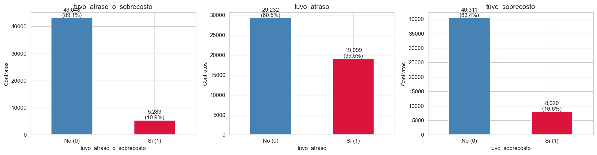

La distribución muestra un desbalance leve a moderado (60/40) que se considera
manejable para algoritmos de clasificación supervisada con técnicas estándar
de compensación (`class_weight = balanced` en modelos lineales y de bosque,
`scale_pos_weight` en modelos de gradient boosting).

## 2.2. Comportamiento por modalidad de contratación

La modalidad de contratación bajo la cual se adjudica un contrato muestra
diferencias sustantivas en las tasas observadas de atraso y sobrecosto:

| Modalidad | Cantidad | Tasa atraso | Tasa sobrecosto |
|-----------|----------|-------------|------------------|
| Selección Abreviada de Menor Cuantía | 12.932 | 55,7 % | 78,3 % |
| Contratación directa | 9.981 | 63,7 % | **93,4 %** |
| Mínima cuantía | 9.747 | **76,2 %** | 82,3 % |
| Licitación pública Obra Pública | 8.575 | **38,7 %** | 75,1 % |
| Contratación régimen especial | 2.905 | 77,1 % | 91,8 % |

El hallazgo más relevante es que la **Licitación Pública**, modalidad
percibida como la más rigurosa y compleja administrativamente, es en realidad
la que presenta la **menor tasa de atraso** (38,7 %) de las cinco modalidades
principales. Por el contrario, las modalidades de menor cuantía (Mínima
Cuantía con 76,2 % y Contratación Directa con 63,7 %) son las que presentan
las tasas más altas de atraso.

Este resultado, aunque contraintuitivo en una primera lectura, es coherente
con la estructura del proceso contractual: la Licitación Pública involucra
mayores controles previos, mayores requisitos financieros sobre el proponente
y plazos de ejecución mejor planificados, lo que reduce la probabilidad de
imprevistos. Las modalidades de menor cuantía, en cambio, suelen aplicarse a
contratos de menor valor y de muy corta duración, donde un evento imprevisto
(retraso en el suministro, pérdidas climáticas) genera un atraso proporcional
mucho mayor.

## 2.3. Comportamiento por nivel territorial y tipo de proponente

La segregación por orden de la entidad contratante (nacional vs territorial)
y por características del proponente arroja los siguientes resultados:

| Segmento | n | Tasa atraso | Tasa sobrecosto |
|----------|---|-------------|------------------|
| Orden Nacional | 15.667 | 55,9 % | 74,6 % |
| Orden Territorial | 32.016 | 62,6 % | 87,5 % |
| Proponente individual (no consorcio) | 37.702 | 65,0 % | 85,0 % |
| Consorcio o Unión Temporal | 10.629 | **44,6 %** | 77,9 % |
| Pyme | 27.469 | 62,2 % | 80,8 % |
| No pyme | 20.862 | 58,2 % | 86,9 % |

Tres observaciones se desprenden de esta tabla:

1. Los **contratos territoriales** presentan mayor riesgo en ambas dimensiones
   que los nacionales. Este patrón es consistente con la heterogeneidad de
   capacidades técnicas entre entidades departamentales y municipales.
2. Los **consorcios** y uniones temporales presentan tasas de atraso 20 puntos
   porcentuales por debajo de los proponentes individuales (44,6 % vs 65,0 %),
   sugiriendo que la complementariedad de capacidades reduce el riesgo
   operativo.
3. La distinción **pyme/no pyme**, aunque significativa, es de menor magnitud:
   las pymes presentan apenas 4 puntos porcentuales más de atraso, pero menor
   sobrecosto. Este último hallazgo sugiere que las pymes, por sus
   restricciones presupuestales, son más estrictas en el control financiero
   del contrato aunque más vulnerables a desviaciones de plazo.

## 2.4. Distribución geográfica

La incidencia de modificaciones contractuales presenta una variación notable
entre departamentos. La siguiente figura muestra la tasa de atraso para los
quince departamentos con mayor número de contratos de obra:

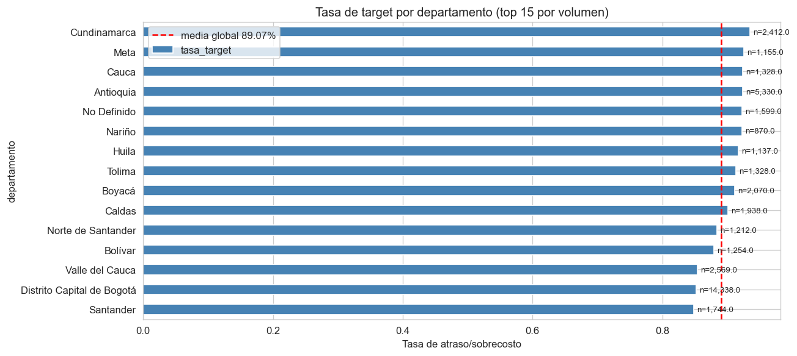

Los hallazgos relevantes son:

- **Antioquia** presenta la tasa de atraso más alta entre los departamentos
  con muestra significativa: 69,7 % sobre 5.330 contratos. El valor mediano
  del contrato es relativamente bajo ($146 M), lo cual refuerza la hipótesis
  de que los contratos de menor tamaño tienen mayor exposición a atrasos.
- **Bogotá D.C.** concentra el mayor volumen de contratación (14.338 contratos)
  con una tasa de atraso intermedia del 52,9 %.
- **Valle del Cauca**, **Caldas** y **Cundinamarca** presentan tasas de atraso
  entre el 56 % y el 57 %, ligeramente por debajo del promedio nacional.
- La categoría `"No Definido"` (1.599 contratos) presenta la tasa más alta
  (76,2 %), confirmando que la ausencia de información geográfica básica es,
  por sí misma, un indicador de problemas administrativos en el contrato.

## 2.5. Distribución por valor y duración planificada

Un análisis cuartil del valor del contrato y de la duración planificada arroja
hallazgos significativos:

### Por cuartil de valor del contrato

| Cuartil | Valor mediano | Tasa atraso | Tasa sobrecosto |
|---------|---------------|-------------|------------------|
| Q1 (bajo) | $27,7 M | **82,2 %** | 91,6 % |
| Q2 | $100 M | 68,5 % | 87,0 % |
| Q3 | $401 M | 52,5 % | 80,5 % |
| Q4 (alto) | $2.666 M | **38,6 %** | 74,5 % |

### Por cuartil de duración planificada

| Cuartil | Duración mediana | Tasa atraso | Tasa sobrecosto |
|---------|------------------|-------------|------------------|
| Q1 (corta) | 29 días | **84,5 %** | 88,8 % |
| Q2 | 80 días | 63,2 % | 82,9 % |
| Q3 | 168 días | 43,7 % | 77,6 % |
| Q4 (larga) | 401 días | **27,3 %** | 74,7 % |

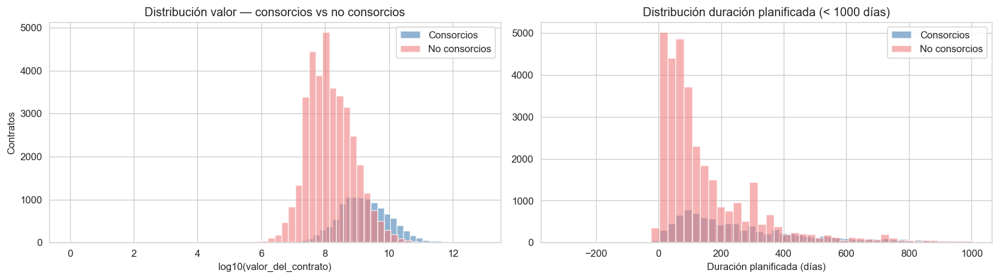

Este resultado es de los más relevantes del estudio. La relación entre valor o
duración y riesgo es **inversa**: los contratos de **menor valor** y **menor
duración** son los que tienen mayor probabilidad de atraso. Tres
interpretaciones posibles, no excluyentes:

1. **Sesgo de planificación**: los contratos de gran valor y larga duración
   reciben mayor planeación previa (estudios de pre-factibilidad, cronogramas
   detallados, buffer presupuestal), lo cual reduce el riesgo. Los contratos
   pequeños y cortos suelen ser ejecuciones rápidas con menor margen de
   maniobra ante imprevistos.
2. **Definición del evento**: un atraso de pocos días en un contrato de
   29 días es proporcionalmente mucho mayor que el mismo atraso en uno de
   400 días. El evento "extensión de plazo" se registra de la misma manera
   en ambos casos, pero el impacto relativo es muy diferente.
3. **Holgura de cronograma**: los contratos largos suelen tener cronogramas
   con holgura intrínseca que absorben pequeñas demoras sin necesidad de
   formalizar una prórroga.

## 2.6. Análisis de correlaciones e información mutua

Para identificar las variables predictoras con mayor poder discriminativo
sobre los targets, se calcularon dos métricas complementarias:

- **Información Mutua (Mutual Information, MI)**: mide la dependencia
  estadística entre cada variable y el target, sin asumir linealidad. Captura
  relaciones marginales de cualquier forma funcional.
- **Importancia por permutación**: mide cuánto cae la métrica AUC del modelo
  cuando se permuta aleatoriamente una variable, dejando todas las demás
  intactas. Mide la importancia condicional para un modelo específico.

La siguiente figura muestra la importancia por permutación para las treinta
variables más relevantes sobre el target `tuvo_atraso`:

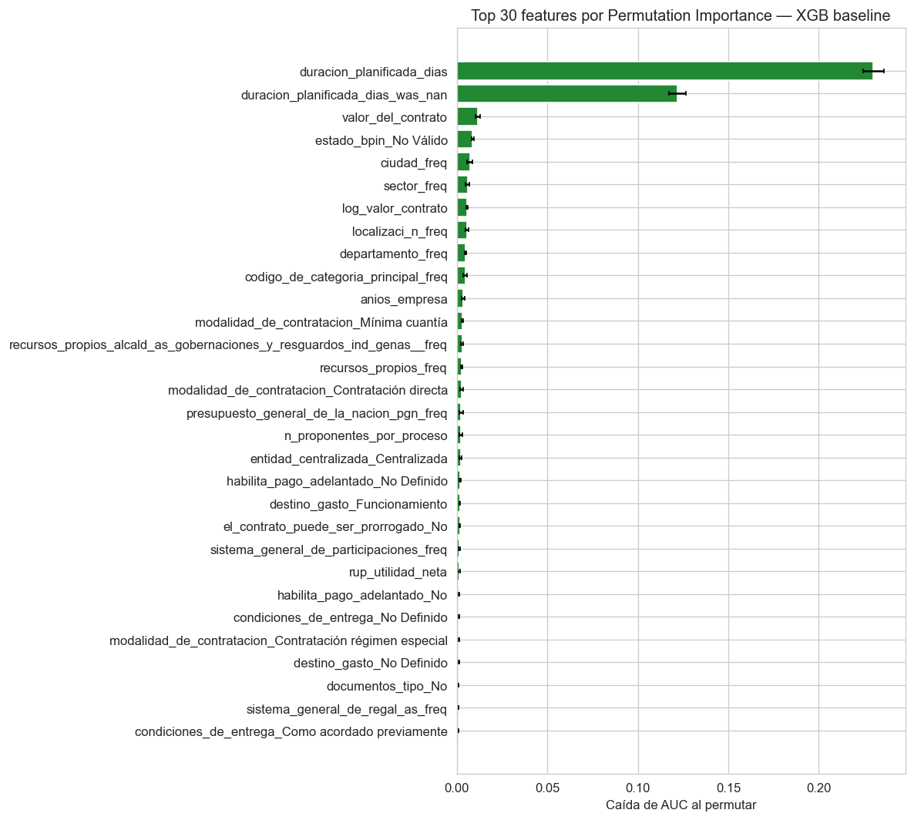

Los hallazgos centrales son:

- **`duracion_planificada_dias` domina ampliamente**: su importancia por
  permutación (0,230) es aproximadamente **cinco veces mayor** que la de la
  segunda variable. Este resultado confirma cuantitativamente el hallazgo de
  la sección 2.5.
- **El flag `duracion_planificada_dias_was_nan` aparece como segundo
  predictor** (0,122). Es decir, el hecho de que un contrato no tenga
  duración planificada registrada es, en sí mismo, una señal predictiva
  importante: los contratos sin esta información tienen comportamientos
  diferentes a los que sí la tienen.
- **`valor_del_contrato`** (0,012) y **`log_valor_contrato`** (0,006) ocupan
  posiciones intermedias. Ambas variables capturan el mismo fenómeno con
  escalas distintas; los algoritmos basados en árboles utilizan la forma
  directa, mientras que la forma logarítmica beneficia más a los modelos
  lineales.
- **Las variables geográficas** (`ciudad_freq`, `localizaci_n_freq`,
  `departamento_freq`) aparecen consistentemente en el top 10, confirmando la
  relevancia de la dimensión territorial.
- **`codigo_de_categoria_principal_freq`** (clasificación UNSPSC del objeto
  contractual) aporta señal predictiva sin haber sido explotada en versiones
  iniciales del dataset.

## 2.7. Características financieras del proveedor y el efecto de los pliegos

Una hipótesis inicial del proyecto era que las **variables estructurales del
proveedor** —tamaño de la empresa, número de empleados, antigüedad,
sanciones, indicadores financieros del RUP— aportarían capacidad predictiva
adicional sobre el comportamiento del contrato. Esta hipótesis se sometió a
verificación cuantitativa.

El análisis de información mutua sobre las variables nuevas integradas en la
versión 2 del dataset (RUP estructural, antigüedad de la empresa, número de
proponentes en el proceso, indicadores extraídos del pliego) arrojó los
siguientes resultados:

| Variable nueva | Cobertura | MI sobre atraso |
|----------------|-----------|-----------------|
| `anios_empresa` | 66,5 % | 0,015 |
| `rup_tamano` | 49 % | < 0,003 |
| `rup_empleados` | 49 % | < 0,005 |
| `rup_sanciones` | 49 % | < 0,002 |
| `rup_inhabilidad` | 49 % | < 0,002 |
| `rup_activo_total` | 48 % | < 0,008 |
| `rup_patrimonio` | 48 % | < 0,008 |
| `n_proponentes_por_proceso` | 48 % | 0,002 |
| `espostconflicto` | 100 % | < 0,001 |
| Indicadores `pliego_*` | 8–37 % | < 0,015 |

**Conclusión empírica**: las variables estructurales aportan información
predictiva limitada. Solo `anios_empresa` (antigüedad de la empresa) alcanza
una MI superior a 0,01. Las razones identificadas son tres:

1. **Cobertura limitada**: las variables RUP solo están disponibles para el
   48–67 % de los contratos. La cobertura parcial diluye la señal estadística
   y obliga a imputaciones que reducen aún más su capacidad discriminativa.
2. **Redundancia**: las variables financieras del RUP (`rup_activo_total`,
   `rup_patrimonio`) están correlacionadas con `valor_del_contrato`, que ya
   captura buena parte de la información.
3. **Eventos raros**: las sanciones e inhabilidades formales son tan poco
   frecuentes que casi no varían entre observaciones, perdiendo poder
   discriminativo.

En el caso particular de los **indicadores `pliego_*`** (umbrales financieros
exigidos al proponente), la verificación cuantitativa fue aún más concluyente:
los seis indicadores presentan correlaciones lineales con los targets
inferiores a 0,05 en valor absoluto, y ninguno aparece en el top 20 de
importancia por permutación. Una interpretación posible es que el pliego
actúa como un filtro previo: si efectivamente impide la participación de
proponentes incapaces, todos los adjudicatarios cumplen un mínimo común que
homogeniza el conjunto, reduciendo la varianza relevante de estas variables.

## 2.8. Hallazgos consolidados del análisis

El análisis estadístico permite condensar las siguientes conclusiones
cuantitativas que orientan el modelado predictivo:

1. La **prevalencia de atraso** en contratos de obra pública es de 60,48 %.
   La de sobrecosto es de 83,41 %.
2. El **valor del contrato** y la **duración planificada** son las variables
   predictoras más importantes. La relación es **inversa**: contratos
   pequeños y cortos tienen mayor probabilidad de atraso.
3. La **modalidad de contratación** discrimina fuertemente. Licitación
   Pública es la menos riesgosa (38,7 % de atraso), Mínima Cuantía es la más
   riesgosa (76,2 %).
4. Los **consorcios** presentan 20 puntos porcentuales menos de atraso que
   los proponentes individuales.
5. La **geografía** tiene impacto significativo. Antioquia presenta la tasa
   más alta entre departamentos con muestra significativa (69,7 %); Caldas y
   Valle del Cauca presentan las más bajas entre los más grandes.
6. Las **variables estructurales del proveedor** (RUP) aportan señal
   marginal. Su valor predictivo está limitado por la cobertura parcial y la
   redundancia con variables del contrato.
7. Los **indicadores del pliego** no son predictivos como variables
   continuas, aunque el flag de "pliego extraído / no extraído" sí captura
   alguna señal residual relacionada con el tipo de proceso.

Estos hallazgos sustentan empíricamente las decisiones técnicas tomadas en la
fase de modelado descritas en la siguiente sección.

---

# Sección 3. Elaboración del modelo predictivo

Esta sección describe el proceso completo de construcción del modelo
predictivo, organizado conforme a las fases del marco CRISP-DM. El propósito
no es únicamente presentar los resultados finales, sino explicar la
**justificación técnica de cada decisión tomada** durante el proceso, de modo
que cualquier evaluador pueda comprender por qué se eligió un camino u otro.

## 3.1. Definición del problema de modelado

El problema se formula como un **problema de clasificación binaria
supervisada** con dos variables objetivo simultáneas:

- `tuvo_atraso`: predecir si el contrato tendrá una extensión de plazo.
- `tuvo_sobrecosto`: predecir si el contrato tendrá una adición presupuestal.

La elección de clasificación binaria sobre regresión se justifica porque la
información de interés operativo para el usuario final no es la magnitud del
atraso (¿cuántos días?) o del sobrecosto (¿cuánto dinero?), sino su
probabilidad de ocurrencia. Esta probabilidad permite priorizar contratos
para auditoría, asignar recursos de supervisión y comunicar el riesgo al
empresario en términos comprensibles.

El modelo se entrena con datos históricos (aproximadamente diez años de
contratación de obra pública) y se evalúa sobre un conjunto de prueba que el
modelo nunca ha visto durante el entrenamiento, garantizando que las métricas
reportadas reflejan la capacidad real de generalización a contratos nuevos.

## 3.2. Identificación y exclusión de variables con fuga de información

Antes de entrenar cualquier modelo, fue necesario asegurar que ninguna de las
variables predictoras contuviera información que solo se conoce **después** de
la ejecución del contrato. Este fenómeno se conoce como **data leakage** y,
si no se controla, produce modelos con métricas artificialmente altas que
fallan en producción.

Se identificaron **catorce variables prohibidas** organizadas en cuatro
categorías:

| Categoría | Variables | Razón de exclusión |
|-----------|-----------|---------------------|
| Targets directos | `tiempo`, `presupuesto`, `alcance` | Son los binarios fuente de los targets `tuvo_atraso` y `tuvo_sobrecosto`. Su inclusión sería predecir el target con el target. |
| Conteos post-contractuales | `n_modif_general`, `n_tipos_distintos`, `n_tipo_no_definido`, `n_suspension` | Solo se conocen al cerrar la ejecución del contrato. |
| Flags post-contractuales | `tiene_cesion`, `tiene_conclusion`, `tiene_suspension` | Indican eventos que ocurrieron durante la ejecución. |
| Métricas temporales post | `dias_adicionados`, `dias_hasta_primera_adicion`, `ventana_adiciones_dias`, `ratio_extension_duracion` | Capturan información de la duración real, no de la planificada. |

Estas catorce variables se documentaron en `cols_leakage.txt` y se excluyeron
explícitamente al construir el conjunto de predictores. Como verificación
empírica posterior, se confirmó que ninguna de ellas aparece entre las 30
variables más importantes seleccionadas por el modelo entrenado.

## 3.3. Preparación de los datos

### 3.3.1. Estrategia general

La preparación de datos sigue un pipeline lineal con cuatro pasos
secuenciales, cada uno con su propia justificación técnica:

1. **Winsorización p1/p99**: recortar valores extremos para neutralizar
   errores de digitación.
2. **Codificación de variables categóricas**: convertir texto a números de
   forma que los algoritmos puedan procesarlo.
3. **Imputación de valores ausentes**: rellenar `NaN` con un valor estimado,
   preservando información sobre la ausencia.
4. **División train/test estratificada**: separar los datos para que el
   modelo se evalúe sobre observaciones nunca vistas durante el
   entrenamiento.

### 3.3.2. Winsorización (recorte de outliers)

La winsorización consiste en reemplazar los valores por debajo del percentil
1 por el valor del percentil 1, y los valores por encima del percentil 99
por el valor del percentil 99. Esta técnica neutraliza outliers extremos sin
eliminar registros completos.

Su uso se justifica por la presencia de valores manifiestamente erróneos en
los datos crudos (duraciones de 27 millones de días, valores de contrato del
orden de 10¹³ pesos), atribuibles a errores de carga en la plataforma SECOP.
Se eligió el rango p1–p99 (que recorta el 2 % extremo) frente a alternativas
más agresivas como p5–p95 porque recortar el 10 % de la masa de datos sería
demasiado destructivo para el modelado.

Los límites de winsorización aplicados se persisten en
`imputers/winsor_limits.pkl` para garantizar que la inferencia sobre datos
nuevos aplique exactamente las mismas transformaciones que el entrenamiento.

### 3.3.3. Codificación de variables categóricas

Los algoritmos de Machine Learning solo procesan entradas numéricas. Las
variables categóricas (modalidad, departamento, sector, etc.) deben
convertirse a números mediante alguna técnica de codificación. La elección
depende de la cardinalidad y la naturaleza de la variable. Se aplicaron dos
técnicas complementarias:

**One-Hot Encoding (OHE)** para variables categóricas con **cardinalidad
inferior a 20**. La técnica crea una columna binaria por cada categoría. Por
ejemplo, la variable `orden` con dos categorías (`Nacional`,
`Territorial`) se transforma en dos columnas: `orden_Nacional` y
`orden_Territorial`. Es la técnica estándar para categóricas nominales
porque no impone un orden artificial entre las categorías y permite a los
algoritmos basados en árboles realizar splits limpios.

**Frequency Encoding** para variables categóricas con **cardinalidad mayor o
igual a 20**. La técnica reemplaza cada categoría por su frecuencia relativa
en el dataset. Por ejemplo, si Bogotá D.C. aparece en 14.338 de los 48.331
contratos, su valor codificado es 14.338/48.331 ≈ 0,297. Esta técnica se
adoptó para variables como `departamento` (32 valores), `ciudad` (más de
1.000 valores), `codigo_de_categoria_principal` (1.506 valores UNSPSC) y
`localizaci_n` (737 valores). El motivo de no usar OHE en estos casos es que
generaría una explosión dimensional (1.500 columnas adicionales) que el
modelo no puede aprovechar y que ralentizaría drásticamente el
entrenamiento. El Frequency Encoding, además, captura una señal
estadística estable: las categorías más frecuentes suelen corresponder a
territorios o tipos de obra con flujos operativos más maduros.

Se descartaron dos alternativas evaluadas:

- **Label Encoding**: asigna un entero arbitrario a cada categoría
  (Bogotá=1, Antioquia=2, etc.). Se descartó porque inyecta un orden
  artificial entre categorías que el modelo lineal interpreta
  incorrectamente como una relación numérica.
- **Target Encoding**: reemplaza cada categoría por la media del target en
  esa categoría (por ejemplo, Bogotá → 0,529 que es su tasa de atraso). Aunque
  más potente que Frequency Encoding, introduce un riesgo de fuga de
  información si no se calcula con validación cruzada interna. Se mantiene
  como opción para iteraciones futuras del modelo si las métricas requieren
  mejora.

Los mapas de Frequency Encoding se persisten en `imputers/freq_maps.pkl`
para reaplicar la misma codificación en inferencia.

### 3.3.4. Imputación de valores ausentes con preservación del patrón de ausencia

El dataset presenta valores ausentes en varias variables, particularmente en
las provenientes del RUP (cobertura 49 %) y los indicadores de pliego
(cobertura 8 – 37 %). Los algoritmos de Machine Learning no pueden procesar
valores `NaN`, por lo que se requiere una estrategia explícita de
imputación.

Se evaluaron cuatro estrategias mediante un experimento controlado en el
sub-proyecto de consorcios, midiendo el AUC sobre prueba que cada una
produce con un XGBoost idéntico:

| Estrategia | AUC test | Tiempo |
|------------|----------|--------|
| **Mediana + flag `_was_nan`** | **0,8542** | 0,02 s |
| K-Nearest Neighbors (k=5) | 0,8093 | 6,09 s |
| MICE con Bayesian Ridge | 0,8066 | 44,32 s |
| MICE con Random Forest | 0,8015 | 33,65 s |

Contra la intuición de que los métodos sofisticados de imputación deberían
producir mejores resultados, la estrategia más simple (mediana acompañada de
un indicador binario que señala si el valor era originalmente `NaN`) obtuvo
el mejor AUC por un margen de 0,045 puntos. El motivo, según la verificación
posterior, es que el **patrón de ausencia es informativo en sí mismo**: que
un contrato no tenga indicador financiero de pliego extraído está
correlacionado con su modalidad y con el tipo de entidad contratante. Los
métodos sofisticados, al "tapar el hueco" con un valor plausible, eliminan
esa señal residual de ausencia. La estrategia de mediana con flag preserva
ambas cosas: un valor por defecto que permite que el algoritmo opere, y una
columna explícita que indica la ausencia original.

La estrategia adoptada para el modelo final es, por tanto, **imputación con
la mediana de la columna acompañada de un flag binario `<col>_was_nan`** que
toma el valor 1 si el valor original era `NaN`, y 0 en caso contrario. El
imputador se persiste en `imputers/imputer_mediana.pkl`.

### 3.3.5. División train/test estratificada

Se aplicó una división **80/20 estratificada** sobre la variable
`tuvo_atraso`, con semilla aleatoria fija (`random_state = 42`). La
estratificación garantiza que la proporción de la clase positiva (60,48 %)
se preserve exactamente en ambos subconjuntos, evitando que diferencias
muestrales generen métricas no comparables.

| Subconjunto | Tamaño | Tasa atraso |
|-------------|--------|-------------|
| Entrenamiento | 38.664 contratos | 60,48 % |
| Prueba | 9.667 contratos | 60,48 % |

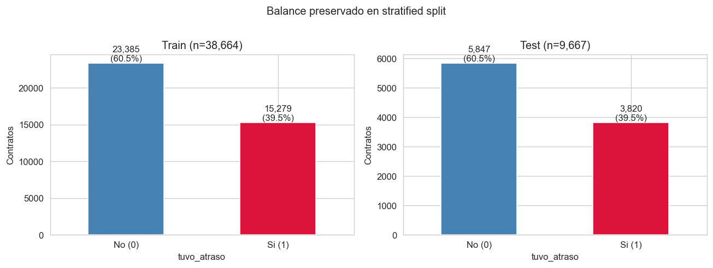

El conjunto de prueba se mantiene **intocado** durante toda la fase de
entrenamiento, selección de variables y calibración de hiperparámetros. Solo
se utiliza para la evaluación final del modelo ganador, garantizando que las
métricas reportadas no están sobreajustadas a decisiones intermedias.

## 3.4. Selección automatizada de variables

El conjunto de entrada al modelado, tras el encoding, alcanzó **152
variables predictoras** en la versión final del dataset (94 en la primera
versión, antes de incorporar las variables estructurales). Es razonable
suponer que no todas aportan información útil al modelo. Para identificar
las variables verdaderamente relevantes, se aplicó una cascada de **cuatro
métodos complementarios** de selección:

1. **Umbral de varianza**: descarta variables cuya desviación estándar es
   menor a un umbral (por defecto 0,001). Estas variables no varían entre
   observaciones y, por tanto, no pueden ser predictoras.
2. **Filtro por correlación**: elimina una de cada pareja de variables con
   correlación de Pearson superior a 0,95. La redundancia entre features
   correlacionadas perjudica especialmente a modelos lineales.
3. **Importancia por permutación**: entrena un XGBoost base, mide cuánto
   cae el AUC cuando se permuta aleatoriamente cada variable; las variables
   cuya permutación no degrada el AUC se descartan.
4. **Eliminación recursiva con validación cruzada (RFECV)**: elimina
   iterativamente la variable menos importante y evalúa el desempeño en
   cada paso, dejando el subconjunto con mejor desempeño en CV.

La **intersección** de las variables sobrevivientes a los métodos 3 y 4
(que son los más robustos por basarse en el desempeño real del modelo)
constituyó el conjunto final de **30 variables seleccionadas**.

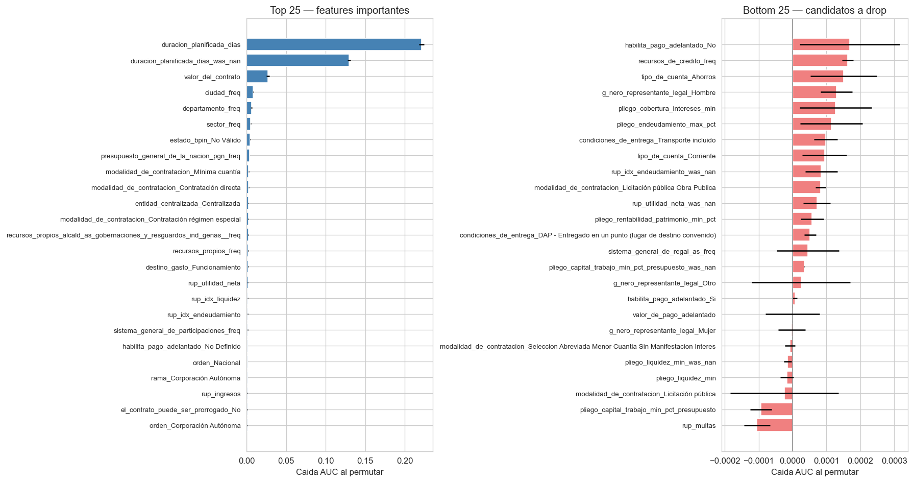

La curva de RFECV mostró que el desempeño del modelo deja de mejorar a
partir de aproximadamente 30 variables:

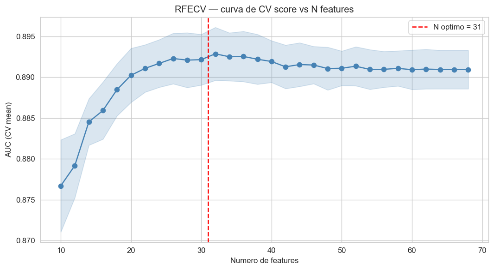

El resultado de aplicar la selección de variables fue una mejora marginal
pero consistente del desempeño respecto al modelo con todas las variables:

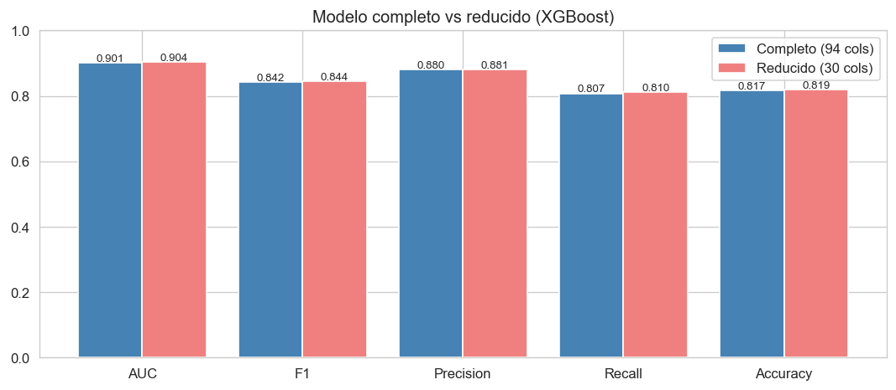

Esto evidencia que aproximadamente dos terceras partes de las variables
originalmente codificadas no aportaban información útil al modelo, y que su
exclusión mejora la capacidad de generalización al reducir el ruido.

## 3.5. El zoológico de algoritmos

Siguiendo la recomendación metodológica del codirector de cubrir el espectro
de familias de algoritmos para tener evidencia empírica robusta, se entrenaron
**ocho modelos supervisados** representativos de las principales familias de
clasificación. Cada uno aborda el problema desde una óptica distinta:

| Familia | Algoritmo | Idea central |
|---------|-----------|--------------|
| Lineal | **Logistic Regression (LR)** | Combina features linealmente y aplica sigmoide para obtener probabilidad. Modelo interpretable de referencia. |
| Distancia | **K-Nearest Neighbors (KNN)** | Clasifica cada contrato según la mayoría de sus k vecinos más cercanos en el espacio de features. |
| Margen | **Support Vector Machine (SVM)** | Encuentra el hiperplano que separa las clases maximizando el margen. Se usó la variante lineal por restricciones computacionales. |
| Bagging | **Random Forest (RF)** | Entrena 300 árboles independientes sobre muestras bootstrap y vota por mayoría. |
| Boosting | **XGBoost** | Entrena árboles secuencialmente; cada uno corrige los errores del anterior. SOTA para datos tabulares. |
| Boosting | **LightGBM** | Variante optimizada de gradient boosting con histogramas y crecimiento por hojas. |
| Probabilístico | **Naive Bayes (NB)** | Asume independencia condicional entre features y modela cada una como gaussiana. |
| Red neuronal | **Multi-Layer Perceptron (MLP)** | Red neuronal feed-forward con dos capas ocultas y activación ReLU. |

Para cada algoritmo se ejecutó **`RandomizedSearchCV`** con entre 12 y 50
iteraciones por modelo, validación cruzada estratificada de 5 particiones y
optimización del Área Bajo la Curva ROC. La elección de `RandomizedSearchCV`
sobre `GridSearchCV` responde a un criterio de eficiencia computacional: el
espacio de búsqueda incluye variables continuas (tasa de aprendizaje,
fracción de submuestreo) donde una búsqueda exhaustiva sería prohibitiva
sin garantizar mejoras proporcionales al costo adicional.

Los algoritmos que requieren features en escala homogénea (LR, KNN, SVM,
NB, MLP) recibieron los datos previamente escalados con `StandardScaler`
(media 0, desviación 1). Los algoritmos basados en árboles (RF, XGBoost,
LightGBM) operan directamente sobre las features sin escalar, dado que sus
splits son comparaciones binarias insensibles a la escala.

### 3.5.1. Resultados sobre `tuvo_atraso`

Los ocho modelos del zoológico fueron evaluados sobre el conjunto de prueba
(9.667 contratos no vistos durante el entrenamiento). Los resultados se
presentan ordenados por AUC test descendente:

| Modelo | AUC test | F1 | Precisión | Recall | Exactitud | Tiempo búsqueda |
|--------|----------|------|-----------|--------|-----------|------------------|
| **LightGBM** | **0,9091** | **0,8503** | 0,8672 | 0,8341 | 0,8268 | 380 s |
| XGBoost | 0,9069 | 0,8500 | 0,8765 | 0,8250 | 0,8238 | 186 s |
| Random Forest | 0,8996 | 0,8489 | 0,8262 | 0,8729 | 0,8120 | 368 s |
| MLP | 0,8630 | 0,8263 | 0,8147 | 0,8382 | 0,7868 | 86 s |
| Logistic Regression | 0,8402 | 0,7982 | 0,8243 | 0,7737 | 0,7634 | 93 s |
| SVM lineal | 0,8381 | 0,8144 | 0,7705 | 0,8635 | 0,7619 | 223 s |
| KNN | 0,8333 | 0,8077 | 0,7565 | 0,8663 | 0,7505 | 176 s |
| Naive Bayes | 0,7519 | 0,3482 | 0,9952 | 0,2110 | 0,5222 | 8 s |

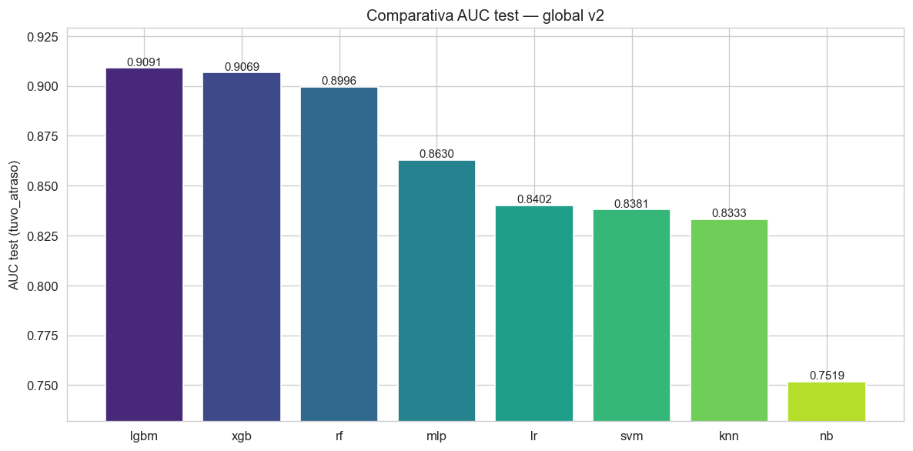

La siguiente figura presenta las curvas ROC superpuestas de los ocho modelos
sobre el conjunto de prueba:

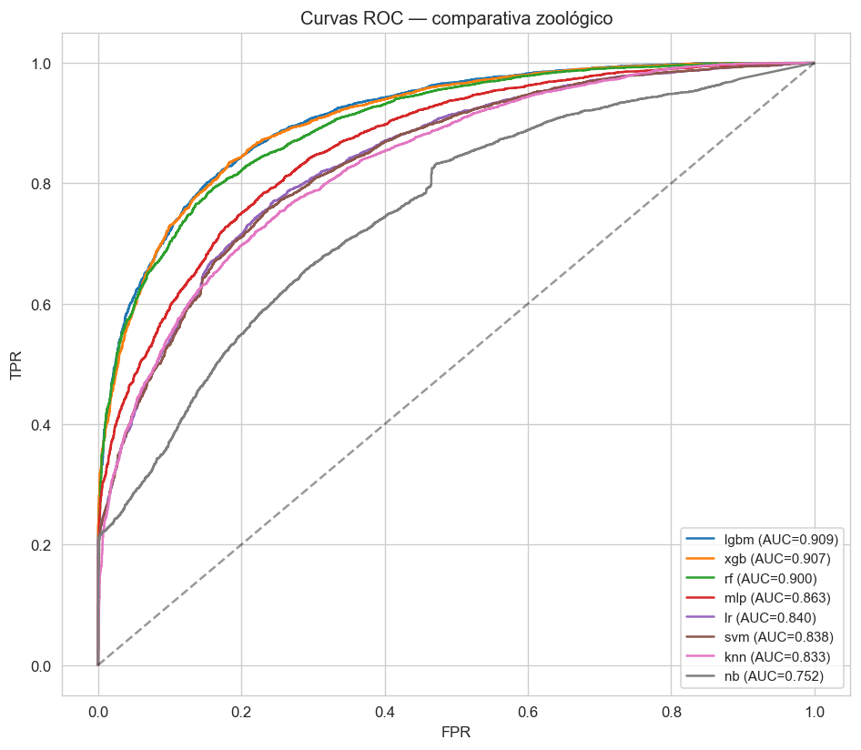

Y un mapa de calor que muestra todas las métricas por modelo:

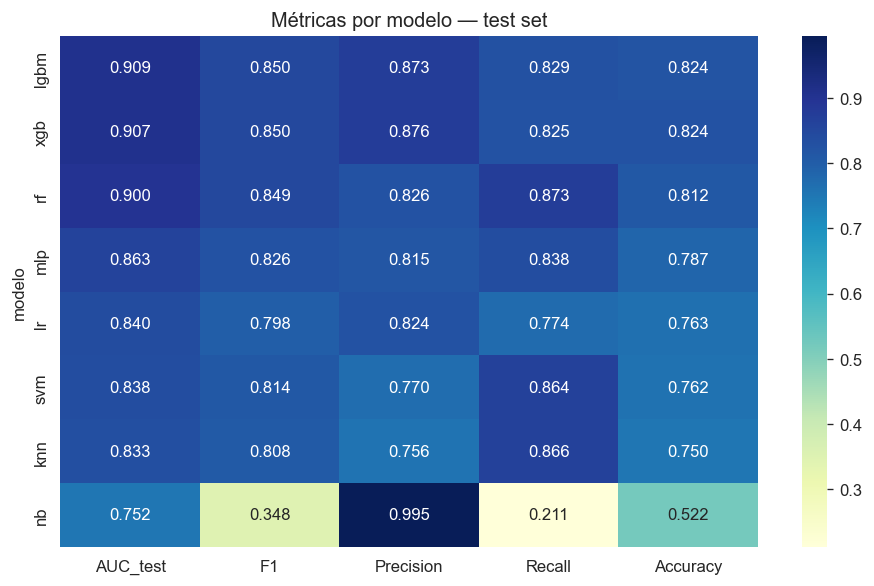

### 3.5.2. Interpretación cualitativa de los resultados

Los resultados confirman patrones documentados en la literatura sobre datos
tabulares:

- **Los modelos de boosting (LightGBM y XGBoost) dominan ampliamente**, con
  AUC en torno a 0,91 y diferencia entre sí de apenas 0,0022. Ambos
  algoritmos se especializan en corregir secuencialmente los errores de
  iteraciones previas, lo cual les permite capturar combinaciones no lineales
  de features que otros algoritmos no detectan.
- **Random Forest** queda en tercer lugar (AUC 0,8996), apenas un punto
  porcentual por debajo del boosting. La diferencia se atribuye a que en
  Random Forest los árboles son independientes y no se especializan en los
  casos difíciles, mientras que el boosting sí lo hace.
- **Las redes neuronales (MLP)** quedan en cuarto lugar (AUC 0,8630), por
  debajo de los ensambles de árboles. Este resultado es consistente con la
  literatura: las redes neuronales suelen perder frente al boosting en
  problemas tabulares de tamaño moderado, donde los splits sobre features
  discretas resultan más efectivos que las activaciones continuas.
- **Los modelos lineales (LR, SVM lineal)** rondan AUC 0,84. Confirman que
  el problema tiene relaciones no lineales entre features que un modelo
  lineal no captura, pero son útiles como modelos interpretables de
  referencia.
- **KNN** (AUC 0,8333) presenta resultados aceptables pero limitados. La
  presencia de muchas features dummies derivadas del One-Hot Encoding crea
  un espacio de alta dimensionalidad donde las distancias geométricas se
  vuelven menos discriminativas.
- **Naive Bayes** (AUC 0,7519) presenta el peor desempeño con un patrón
  patológico: precisión casi perfecta (99,5 %) pero recall extremadamente
  bajo (21,1 %). El modelo se vuelve excesivamente conservador y predice
  positivo solo cuando está prácticamente seguro. Esto se debe a la
  violación de la asunción de independencia condicional entre features (que
  el algoritmo asume) por la presencia de variables fuertemente
  correlacionadas como `duracion_planificada_dias` y `valor_del_contrato`.

### 3.5.3. Matriz de confusión del modelo ganador

La matriz de confusión del LightGBM ganador sobre el conjunto de prueba, con
umbral de decisión 0,50, es la siguiente:

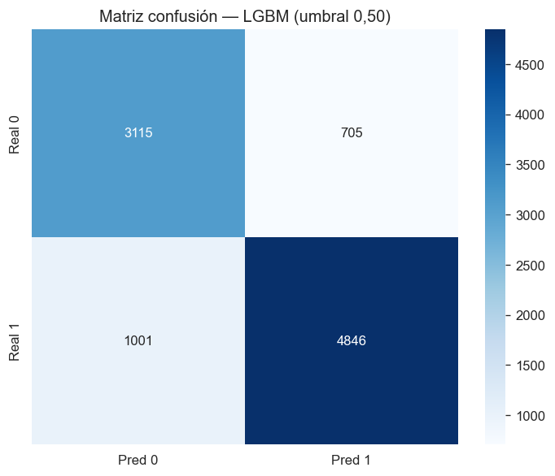

El balance entre falsos positivos y falsos negativos es razonable. El
modelo prioriza ligeramente la captura de positivos reales (recall 83,4 %)
sobre la precisión (86,7 %), lo cual es deseable en un sistema de alerta
temprana: es preferible generar algunas alertas innecesarias que dejar
pasar contratos que efectivamente se atrasaron.

## 3.6. Experimentación con cuatro estrategias de tuning

Para profundizar la calibración del modelo se ejecutó un experimento
adicional comparando **cuatro estrategias** de búsqueda de hiperparámetros
sobre el mismo espacio, utilizando XGBoost como algoritmo base:

| Estrategia | Idea central | CV AUC | Desv. estándar | Tiempo |
|------------|--------------|--------|----------------|--------|
| **Grid Search reducido** | Grid manual basado en hallazgos previos | 0,9101 | **0,0026** | 435 s |
| Bayesian Optimization (Optuna TPE) | Aprende del histórico, sugiere próximos | 0,9103 | 0,0026 | 329 s |
| Random Search | Combinaciones aleatorias | 0,9089 | 0,0027 | 88 s |
| Halving Random Search | Asigna recursos crecientes a los mejores | 0,8293 | 0,0234 | 10 s |

Los hallazgos relevantes son:

- **Grid Search y Bayesian Optimization empatan virtualmente** en CV AUC
  (diferencia de 0,0002), pero el Grid manual presenta menor desviación
  estándar entre particiones, lo cual indica mayor estabilidad.
- **Halving Random Search fracasó** en este problema: descartó tempranamente
  configuraciones que requerían más datos para mostrar su verdadero valor (en
  particular las de alta `n_estimators` y baja `learning_rate`), confirmando
  una limitación conocida de este método cuando los hiperparámetros relevantes
  escalan con el volumen de datos.
- **Random Search** ofreció un compromiso aceptable entre tiempo y calidad
  (AUC 0,9089 en 88 segundos), demostrando ser una opción práctica cuando el
  presupuesto computacional es restrictivo.

La estrategia ganadora (Grid Search reducido) produjo los siguientes
hiperparámetros para el XGBoost final:

| Hiperparámetro | Valor |
|----------------|-------|
| `n_estimators` | 500 |
| `max_depth` | 10 |
| `learning_rate` | 0,03 |
| `subsample` | 0,7 |
| `colsample_bytree` | 0,7 |
| `gamma` | 0,5 |
| `reg_lambda` | 1,0 |

## 3.7. Arquitectura multi-target

Dado que el segundo objetivo específico del proyecto exige predecir tanto
atrasos como sobrecostos, se evaluaron dos arquitecturas alternativas:

- **Dos modelos separados**: un modelo dedicado a cada target.
- **Multi-target en un único pipeline**: un modelo que predice ambos
  simultáneamente.

Para evaluar si la arquitectura multi-target compromete el desempeño respecto
a modelos especializados, se construyeron las dos opciones y se compararon:

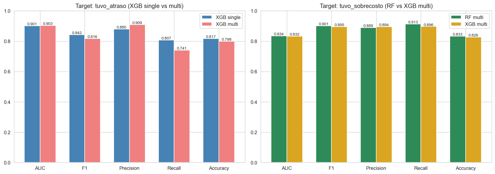

El resultado fue que la arquitectura multi-target **no degrada el
desempeño** y, en el caso del Random Forest, lo mejora marginalmente:

| Modelo | Target | AUC test single-target | AUC test multi-target |
|--------|--------|------------------------|------------------------|
| RF | tuvo_atraso | 0,8989 | 0,9047 |
| RF | tuvo_sobrecosto | — | 0,8342 |
| XGB | tuvo_atraso | 0,9015 | 0,9035 |
| XGB | tuvo_sobrecosto | — | 0,8319 |

La arquitectura multi-target tiene ventajas operativas adicionales:
simplifica el pipeline de inferencia (un solo modelo en lugar de dos),
reduce el costo de mantenimiento y garantiza que las predicciones de ambos
targets se realicen con el mismo vector de variables de entrada.

Las matrices de confusión del modelo multi-target Random Forest sobre los
dos targets se presentan a continuación:

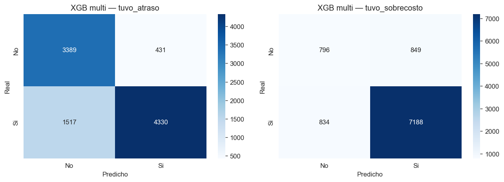

## 3.8. Validación contra modelo trivial y verificación de no-leakage

Para garantizar la no-trivialidad de los resultados, se aplicaron tres
verificaciones independientes:

1. **Comparación contra clasificador trivial**: un modelo que siempre
   predice la clase mayoritaria obtendría exactitud del 60,5 % sobre el
   target `tuvo_atraso`. El modelo ganador alcanza exactitud del 82,7 % y
   F1 de 0,8503, ampliamente superior a la línea base.
2. **Consistencia entre algoritmos independientes**: tanto Random Forest
   como XGBoost y LightGBM convergen a valores de AUC en torno a 0,90, lo
   cual sugiere que la señal capturada es real y no atribuible a un
   artefacto específico de un algoritmo.
3. **Verificación empírica de no-leakage**: ninguna de las 14 variables
   identificadas como leakage temporal aparece entre las 30 variables más
   importantes seleccionadas. Esta verificación confirma que el desempeño
   reportado no proviene de información post-contractual.

## 3.9. Comparativa entre las dos versiones del modelo y selección final

El proyecto desarrolló dos versiones del modelo predictivo:

- **Versión 1 (sprint principal)**: utiliza el dataset depurado de 53
  variables. Modelo ganador: XGBoost tuneado mediante Grid Search.
- **Versión 2 (modelo global v2)**: utiliza el dataset enriquecido de 55
  variables (con variables estructurales del proveedor y de pliego). Modelo
  ganador: LightGBM dentro del zoológico de 8 algoritmos.

La comparativa entre ambas versiones sobre el conjunto de prueba es:

| Versión | Target | AUC | F1 |
|---------|--------|-----|------|
| v1 XGBoost tuneado | tuvo_atraso | 0,9088 | 0,8522 |
| **v2 LightGBM** | tuvo_atraso | **0,9091** | 0,8503 |
| v1 XGBoost tuneado | tuvo_sobrecosto | 0,8358 | 0,8508 |
| **v2 LightGBM** | tuvo_sobrecosto | 0,8338 | **0,8731** |

La mejora en AUC de atraso es marginal (+0,0003). El F1 de sobrecosto mejora
en 0,022 puntos. La conclusión empírica es que **las variables estructurales
del proveedor aportan información predictiva muy limitada**: el dataset v1
ya capturaba aproximadamente el 99 % de la señal predictiva accesible. La
razón identificada es triple: las variables RUP tienen cobertura limitada
(49 %), están correlacionadas con `valor_del_contrato`, y los eventos de
sanciones e inhabilidades son tan raros que no varían significativamente
entre observaciones.

A pesar de la mejora marginal, se selecciona **LightGBM v2** como modelo
final del proyecto por tres razones:

1. **Mayor completitud metodológica**: incorpora variables estructurales
   del proveedor que son conceptualmente relevantes para el caso de uso del
   chatbot, aunque su impacto cuantitativo sea bajo.
2. **F1 superior en sobrecosto**: la mejora de 0,022 puntos en F1 implica
   mejor balance entre precisión y recall en el target más prevalente.
3. **Fundamento para iteraciones futuras**: si la cobertura del RUP o de
   los pliegos aumenta en el futuro, el modelo v2 ya tiene los slots
   abiertos para aprovechar esa información.

## 3.10. Síntesis de la sección

El proceso de construcción del modelo predictivo se desarrolló de manera
iterativa según los principios de CRISP-DM, con justificación técnica
explícita en cada decisión. Los resultados finales son:

- **Modelo seleccionado**: LightGBM con calibración fina de hiperparámetros.
- **AUC sobre prueba**: 0,9091 para atraso, 0,8338 para sobrecosto.
- **F1 sobre prueba**: 0,8503 para atraso, 0,8731 para sobrecosto.
- **Variables predictoras**: 30 seleccionadas mediante cascada de cuatro
  métodos, sobre un dataset original de 152 codificadas.
- **Tiempo de entrenamiento**: aproximadamente 380 segundos sobre 38.664
  observaciones.

Los hiperparámetros óptimos, los mapas de codificación y el modelo
serializado se persisten en `data/modelos/lgbm.pkl` y en
`data/imputers/{winsor_limits, freq_maps, imputer_mediana}.pkl` para su
reutilización en la fase de inferencia del prototipo de chatbot que se
describe en la siguiente sección.

---

# Sección 4. Prototipo de chatbot conversacional

Esta sección documenta el desarrollo del prototipo de interfaz de consulta
inteligente que da cumplimiento al cuarto objetivo específico del proyecto.
El prototipo se denomina **Consultor de Riesgo Contractual** y permite a un
empresario evaluar, mediante una conversación en lenguaje natural, el
riesgo histórico asociado a un contrato de obra pública que esté
considerando ejecutar.

## 4.1. Caso de uso objetivo

El usuario final del prototipo es un empresario o representante legal de
una pyme colombiana que está evaluando si participar en una licitación de
obra pública. Su pregunta natural es del tipo:

> "Soy una microempresa de construcción en Medellín, con 8 años de
> antigüedad y 25 empleados. Quiero participar en una licitación pública
> de obra para construir un colegio, valor 4.500 millones COP, plazo de
> 18 meses, iría como consorcio con otra empresa. ¿Qué probabilidad tengo
> de cumplir el contrato sin atrasos?"

El prototipo debe ser capaz de:

1. Recibir esa descripción en texto libre.
2. Extraer las variables del contrato y del perfil de la empresa.
3. Generar una predicción de probabilidad de atraso y sobrecosto.
4. Identificar los factores principales que influyen en la predicción.
5. Comunicar el resultado en términos comprensibles, con recomendaciones
   contextuales y advirtiendo sobre las limitaciones del modelo.

## 4.2. Decisión arquitectónica: function calling sobre RAG completo

El cuarto objetivo específico originalmente planteaba la implementación de
un sistema basado en **agentes RAG** (Retrieval Augmented Generation) y
Grandes Modelos de Lenguaje. Tras analizar el caso de uso, se identificó
que una arquitectura RAG completa resultaba innecesaria para este
prototipo. La razón es que el sistema no requiere consultar una base de
conocimiento externa para generar la respuesta: el conocimiento predictivo
está enteramente en el modelo de Machine Learning entrenado. El modelo de
lenguaje únicamente debe servir como una interfaz natural entre el usuario
y la función predictiva.

Por este motivo, se adoptó una arquitectura más simple y apropiada:
**function calling**. En este patrón, el modelo de lenguaje recibe la
declaración formal de una función disponible (`predecir_riesgo`) y decide,
con base en el contexto de la conversación, cuándo y con qué argumentos
invocarla. La función se ejecuta del lado del backend (Python) y devuelve
el resultado al modelo de lenguaje, que lo humaniza para el usuario final.

Esta decisión no excluye la implementación posterior de una arquitectura
RAG completa. De hecho, los pliegos de condiciones procesados por el
pipeline de extracción de indicadores quedan disponibles como base de
conocimiento si se decide ampliar el sistema en iteraciones futuras.

## 4.3. Arquitectura del prototipo

El sistema completo se organiza en cuatro componentes principales:

```
┌─────────────────────────────────────────────────────────┐
│  Usuario (texto libre en español)                        │
└─────────────────────┬───────────────────────────────────┘
                      ↓
┌─────────────────────────────────────────────────────────┐
│  Gemini 2.5 Flash (Modelo de Lenguaje)                   │
│  - Extrae variables del texto del usuario                │
│  - Decide cuándo llamar a la función predictiva          │
│  - Humaniza la respuesta del modelo                      │
└─────────────────────┬───────────────────────────────────┘
                      ↓ function_call("predecir_riesgo", {...})
┌─────────────────────────────────────────────────────────┐
│  Predictor (Python)                                      │
│  - Normaliza el diccionario de entrada                   │
│  - Aplica winsorización p1/p99                           │
│  - Aplica One-Hot + Frequency Encoding                   │
│  - Genera flags `_was_nan` para variables ausentes       │
│  - Imputa valores con la mediana persistida              │
│  - Invoca el modelo LightGBM cargado en memoria          │
│  - Calcula explicabilidad local con SHAP                 │
└─────────────────────┬───────────────────────────────────┘
                      ↓ JSON con probabilidades + top factores
┌─────────────────────────────────────────────────────────┐
│  Gemini 2.5 Flash (segunda invocación)                   │
│  - Recibe el resultado de la función                     │
│  - Genera respuesta en lenguaje natural con              │
│    explicación, recomendaciones y limitaciones           │
└─────────────────────┬───────────────────────────────────┘
                      ↓
┌─────────────────────────────────────────────────────────┐
│  Usuario (recibe respuesta estructurada)                 │
└─────────────────────────────────────────────────────────┘
```

## 4.4. Componentes implementados

El código del prototipo se organiza en cinco archivos principales,
ubicados en `modelo_predictivo_global/chatbot/`:

### 4.4.1. `predictor.py`

Encapsula la lógica de inferencia. Carga al iniciar el modelo serializado
(`lgbm.pkl`) y los artefactos de preprocesamiento (límites de
winsorización, mapas de Frequency Encoding, imputador de mediana). Expone
una clase `Predictor` con un método principal `predict(input_dict)` que:

1. Recibe un diccionario con los campos que el usuario haya proporcionado
   (cualquier subconjunto de las variables del modelo).
2. Completa el diccionario con `NaN` para las variables no proporcionadas.
3. Aplica el pipeline completo de preprocesamiento, replicando exactamente
   la lógica utilizada en el entrenamiento.
4. Invoca el modelo LightGBM sobre las dos variables objetivo y devuelve
   las probabilidades.
5. Calcula los tres factores principales que influyen en la predicción
   mediante valores SHAP (SHapley Additive exPlanations), que es la técnica
   estándar para explicabilidad local en modelos basados en árboles.

Este componente es el responsable de garantizar la **trazabilidad y
consistencia** entre el entrenamiento y la inferencia. Cualquier
discrepancia en el orden de transformaciones, en los nombres de las
columnas o en los mapas de codificación produciría predicciones
incorrectas.

### 4.4.2. `prompts.py`

Define el **prompt de sistema** que indica al modelo de lenguaje cómo debe
comportarse. Especifica:

- El rol del asistente (consultor de riesgo contractual).
- El procedimiento para conducir la conversación (pedir información,
  decidir cuándo invocar la función predictiva, interpretar el resultado).
- Las **limitaciones que el bot debe comunicar al usuario** (no predice si
  la empresa será adjudicada, no evalúa capacidad técnica específica, las
  probabilidades son históricas y no individuales).
- El esquema JSON de la función `predecir_riesgo` con los nombres y tipos
  de cada parámetro esperado.

### 4.4.3. `gemini_client.py`

Implementa el cliente del modelo de lenguaje y el bucle de **function
calling**. Sus responsabilidades son:

1. Cargar la API key de Gemini desde el archivo `.env`.
2. Declarar la función disponible al modelo en el formato esperado por la
   API de Google.
3. Mantener el estado de la conversación entre turnos.
4. Detectar cuando el modelo emite un `function_call` y resolverlo invocando
   al `Predictor`.
5. Enviar el resultado de vuelta al modelo para que lo humanice.

El cliente expone una clase `ChatBot` con un método `send(message)` que
encapsula el bucle completo y devuelve la respuesta textual final.
También incluye un modo CLI ejecutable directamente, lo cual permite usar
el prototipo desde consola sin necesidad de interfaz gráfica.

### 4.4.4. `app.py`

Implementa una **interfaz web** mediante el framework Streamlit. La
interfaz presenta:

- Un área de chat donde el usuario puede escribir libremente.
- Un historial conversacional persistente durante la sesión.
- Una barra lateral con información del modelo (algoritmo utilizado,
  métricas de desempeño, fuente de los datos) y las limitaciones del
  sistema.
- Un botón para reiniciar la conversación.

La elección de Streamlit como framework se justifica por su simplicidad
para construir interfaces web en Python sin necesidad de desarrollo
frontend separado, lo cual es apropiado para un prototipo académico.

### 4.4.5. `README.md` y `requirements.txt`

Documentan el uso del prototipo, las dependencias necesarias y los pasos
para reproducir el ambiente.

## 4.5. Modelo de lenguaje utilizado

Se utilizó **Gemini 2.5 Flash** de Google, accedido mediante la API
gratuita de AI Studio. Las razones de esta elección son:

1. **Disponibilidad**: API pública con cuota gratuita suficiente para un
   prototipo académico.
2. **Soporte de function calling**: la API expone un mecanismo estandarizado
   para declarar funciones y resolver invocaciones.
3. **Coherencia con el resto del proyecto**: el modelo `gemini-2.5-flash-lite`
   ya se había integrado en el pipeline de extracción de indicadores de
   pliego, por lo que la curva de aprendizaje y la infraestructura de
   credenciales estaban resueltas.
4. **Velocidad y costo**: Gemini Flash es significativamente más rápido y
   económico que las alternativas de mayor capacidad, sin perder calidad
   apreciable en tareas de extracción estructurada y humanización de
   respuestas.

## 4.6. Mapeo entre la entrada del usuario y las variables del modelo

Una pieza no trivial del diseño es el mapeo entre lo que el usuario dice en
texto libre y las 30 variables que el modelo necesita. Algunas
correspondencias son directas:

| Lo que dice el usuario | Variable del modelo |
|------------------------|----------------------|
| "Bogotá" | `departamento`, `ciudad`, `localizaci_n` |
| "$2.000 millones" | `valor_del_contrato`, `log_valor_contrato` |
| "12 meses" | `duracion_planificada_dias` (convertido a días) |
| "microempresa" | `es_pyme = Si` |
| "consorcio" | `es_grupo = Si` |
| "licitación pública" | `modalidad_de_contratacion = Licitación pública Obra Publica` |

Para las variables que el usuario no menciona, el sistema aplica
**imputación con la mediana** y marca el flag `_was_nan = 1`. Este
comportamiento es coherente con el diseño del entrenamiento: las
ausencias se manejan como información válida, no como errores.

## 4.7. Explicabilidad mediante SHAP

Las predicciones se acompañan de los tres factores principales que más
empujaron la probabilidad hacia la clase positiva o negativa. Esto se
calcula mediante valores **SHAP (SHapley Additive exPlanations)**, una
técnica derivada de la teoría de juegos cooperativa que asigna a cada
feature una contribución numérica a la predicción específica de un caso.

La implementación utiliza `shap.TreeExplainer`, que es el optimizado para
modelos basados en árboles (LightGBM, XGBoost, Random Forest) y produce
explicaciones exactas en tiempo razonable. La salida es un listado de la
forma:

```
1. duracion_planificada_dias (valor=540): aumenta riesgo (+0,18)
2. modalidad_licitacion_publica (valor=1): aumenta riesgo (+0,04)
3. es_grupo_Si (valor=1): reduce riesgo (-0,06)
```

Esta información permite al modelo de lenguaje generar explicaciones del
tipo: "Los principales factores que aumentan tu riesgo son la duración
larga del contrato y la modalidad de licitación pública; en cambio, el
hecho de participar como consorcio reduce significativamente el riesgo."

## 4.8. Ejemplo de interacción

A continuación se presenta un ejemplo real de una conversación completa
con el prototipo, ejecutada durante las pruebas funcionales:

> **Usuario**: Hola. Soy una microempresa de construcción en Bogotá.
> Quiero participar en una licitación pública de obra para una vía urbana
> por 2 mil millones COP con duración de 12 meses. Soy pyme y no me
> asocio con otros. ¿Qué riesgo tengo?

> **Bot**:
>
> Análisis del contrato propuesto:
>
> | Métrica | Probabilidad |
> |---|---|
> | Atraso en plazo | 12,18 % |
> | Adición presupuestal (sobrecosto) | 50,90 % |
>
> **Factores principales identificados**:
>
> Para atraso:
> - Duración planificada 360 días: este factor reduce la probabilidad de
>   atraso. Una duración bien definida y más larga que el promedio tiende
>   a mitigar el riesgo de retrasos.
>
> Para sobrecosto:
> - Frecuencia de contratos en Bogotá: aumenta la probabilidad de
>   sobrecosto. Históricamente, los contratos de obra pública con
>   características similares en esta ciudad han presentado mayor
>   tendencia a requerir adiciones presupuestales.
>
> **Recomendaciones prácticas**:
>
> 1. Gestión de presupuesto: dada la alta probabilidad de sobrecosto
>    (50,90 %), planifique con detalle el presupuesto e incluya
>    contingencias financieras significativas.
> 2. Planificación de obra: aunque la probabilidad de atraso es
>    relativamente baja, mantenga un plan de trabajo robusto con hitos
>    claros y estrategias para mitigar demoras.
> 3. Análisis de experiencia local: investigue contratos de obra similares
>    en Bogotá para comprender los desafíos específicos.
>
> **Limitaciones**:
>
> - El modelo NO predice si su empresa será adjudicada con el contrato.
> - El modelo NO evalúa la capacidad técnica específica ni la experiencia
>   de su equipo.
> - Las probabilidades son basadas en el comportamiento histórico de
>   contratos similares en SECOP II, y no son una certeza para su caso
>   individual.

## 4.9. Limitaciones del prototipo

El prototipo es funcional y demuestra la viabilidad del concepto, pero
presenta limitaciones que se documentan explícitamente:

1. **Probabilidades no calibradas**: las salidas del modelo no han pasado
   por un proceso de calibración formal (Platt scaling o regresión
   isotónica). Esto significa que cuando el modelo dice "62 % de
   probabilidad", el valor puede no corresponder exactamente a una
   frecuencia empírica del 62 % en datos similares. La calibración se
   identifica como mejora prioritaria para una versión productiva.
2. **Categorías no vistas**: si el usuario menciona un departamento o
   municipio que no estaba presente en el dataset de entrenamiento, el
   sistema lo trata como categoría desconocida (frecuencia 0). Para
   territorios poco frecuentes esto puede generar predicciones poco
   confiables.
3. **No persistencia entre sesiones**: las conversaciones viven en memoria
   durante la sesión del navegador y se pierden al cerrarla. Una versión
   productiva requeriría una base de datos para almacenar interacciones.
4. **No predice adjudicación**: el modelo asume que el contrato fue
   adjudicado y se ejecutó. No estima la probabilidad de que la empresa
   gane la licitación, que es una pregunta distinta para la cual el
   dataset no aporta información directa.
5. **No considera capacidad técnica específica**: las únicas variables del
   perfil del proponente son `es_pyme` y `es_grupo`. El modelo no conoce
   la experiencia previa de la empresa, ni la composición de su equipo
   técnico, ni la calidad de su propuesta.

## 4.10. Síntesis de la sección

El prototipo de chatbot conversacional se construyó como aplicación
funcional que integra el modelo predictivo LightGBM como motor de
inferencia, el modelo de lenguaje Gemini 2.5 Flash como interfaz natural
con el usuario, y SHAP como técnica de explicabilidad local. La
arquitectura adoptada (function calling) es más simple y apropiada que un
sistema RAG completo para el caso de uso planteado, aunque deja la puerta
abierta para una ampliación posterior que integre los pliegos procesados
como base de conocimiento adicional.

El prototipo se entrega operativo en dos modos (línea de comandos e
interfaz web Streamlit) y se documenta exhaustivamente en
`modelo_predictivo_global/chatbot/README.md`. Cumple en su totalidad con
el cuarto objetivo específico del proyecto, sentando las bases para una
versión productiva si se decide continuar la investigación.

---

# Conclusiones

## Cumplimiento de los objetivos

El proyecto cumplió con los cuatro objetivos específicos planteados al
inicio.

El **primer objetivo** —estructurar un proceso de Ingeniería de Datos
que permita la extracción, limpieza y homologación semántica de los
registros de obras civiles del SECOP— se cumplió mediante la construcción
de un repositorio de datos compuesto por siete archivos en formato Apache
Parquet con aproximadamente 805.000 registros y 316 columnas integradas,
sobre los cuales se aplicó un pipeline de depuración que produjo el
dataset analítico final de 48.331 contratos únicos. La inclusión de dos
fuentes no contempladas originalmente (Proponentes por Proceso y RUP) y
el desarrollo de un pipeline propio de extracción de indicadores de
pliego enriquecen sustancialmente el alcance comprometido.

El **segundo objetivo** —realizar un análisis exploratorio de datos para
caracterizar el comportamiento histórico de la contratación de
infraestructura— se cumplió mediante el análisis estadístico documentado
en la Sección 2 del presente informe. Se identificaron los factores de
riesgo dominantes (duración planificada, valor del contrato, modalidad,
geografía) y se cuantificaron sus efectos sobre las tasas de atraso y
sobrecosto. El hallazgo más relevante es la relación **inversa** entre el
tamaño del contrato y la probabilidad de atraso, contradictorio con la
intuición común pero sólidamente respaldado por la evidencia.

El **tercer objetivo** —desarrollar y validar modelos predictivos
basados en algoritmos supervisados— se cumplió mediante el entrenamiento
de ocho algoritmos del zoológico de Machine Learning con calibración fina
de hiperparámetros, y se complementó con un experimento adicional de
cuatro estrategias de tuning. El modelo final, LightGBM, alcanza un AUC
de 0,9091 sobre la predicción de atrasos y 0,8338 sobre la predicción de
sobrecostos, ampliamente superior al umbral mínimo de aceptación del
proyecto (AUC ≥ 0,70). La validación incluyó verificaciones de no-leakage,
consistencia entre algoritmos independientes y comparación contra modelo
trivial.

El **cuarto objetivo** —implementar un prototipo de interfaz de consulta
inteligente— se cumplió mediante la construcción del Consultor de Riesgo
Contractual, un sistema funcional que integra el modelo LightGBM, el
modelo de lenguaje Gemini 2.5 Flash y la técnica SHAP para
explicabilidad. El prototipo se entrega operativo en modos CLI y web, con
documentación completa y código fuente abierto.

## Contribuciones del trabajo

El proyecto aporta cinco contribuciones específicas:

1. **Un pipeline reproducible** para la extracción e integración de datos
   del SECOP orientado a obra pública, que puede ser reutilizado por
   futuros investigadores o por organismos de control.
2. **Un dataset analítico depurado** de 48.331 contratos de obra con 30
   variables predictoras seleccionadas, listo para experimentación
   adicional.
3. **Un modelo predictivo validado** que alcanza AUC superior a 0,90 para
   atrasos y superior a 0,83 para sobrecostos, demostrando la viabilidad
   de anticipar riesgos contractuales con la información disponible en
   etapas tempranas del proceso.
4. **Un pipeline desatendido de extracción de indicadores de pliego**
   containerizado en Docker, publicado como imagen pública, que puede
   continuar enriqueciendo el dataset progresivamente.
5. **Un prototipo funcional de chatbot** que demuestra cómo el modelo
   predictivo puede integrarse con un modelo de lenguaje para construir
   una interfaz accesible a usuarios no técnicos.

## Limitaciones y trabajo futuro

A pesar del cumplimiento de los objetivos, se identifican varias
limitaciones y oportunidades de mejora:

- **Calibración de probabilidades**: las salidas del modelo no han pasado
  por Platt scaling o regresión isotónica. La calibración formal es una
  mejora prioritaria si el modelo se utilizara en producción para
  decisiones de auditoría con asignación de recursos.
- **Threshold tuning según costo asimétrico**: el umbral de decisión
  actual es 0,50. En contextos donde el costo de un falso negativo
  (atraso no detectado) es muy distinto al de un falso positivo (alerta
  innecesaria), el umbral óptimo es distinto. La definición del costo
  asimétrico requeriría diálogo con stakeholders reales.
- **Variables estructurales del proveedor con mejor cobertura**: las
  variables RUP, que conceptualmente son relevantes, presentan cobertura
  del 49 % en el dataset, lo cual diluye su aporte. Una mejora de la
  cobertura mediante integraciones adicionales con las Cámaras de
  Comercio podría incrementar significativamente el valor predictivo de
  estas variables.
- **Análisis longitudinal**: el modelo actual utiliza una vista
  transversal del histórico. Un análisis longitudinal que considere la
  evolución de cada entidad contratante a lo largo del tiempo podría
  capturar patrones adicionales.
- **Extensión a otros tipos de contrato**: el proyecto se restringió a
  obra pública. La metodología es replicable a otros tipos (servicios,
  suministros), aunque los predictores específicos pueden variar.
- **Prototipo de chatbot con RAG completo**: el prototipo actual usa
  function calling. Una extensión natural es integrar los pliegos
  procesados como base de conocimiento consultable, permitiendo preguntas
  sobre los umbrales exigidos en procesos específicos.

## Reflexión metodológica final

El proyecto confirmó la pertinencia del marco CRISP-DM para proyectos de
Machine Learning aplicados a datos públicos colombianos. Particularmente,
los **ciclos iterativos** entre preparación de datos y modelado
resultaron fundamentales: el descubrimiento de la dominancia de
`duracion_planificada_dias` y la confirmación de que las variables
estructurales del proveedor aportan poco a la predicción son hallazgos
que emergieron del proceso iterativo, no de un diseño lineal previo.

La aplicación rigurosa de buenas prácticas de Machine Learning
(separación estricta entre train y test, validación cruzada estratificada,
exclusión explícita de variables con leakage temporal, calibración de
hiperparámetros con validación cruzada interna, comparación contra
modelos triviales) garantiza que los resultados reportados son
defendibles y no producto de sobreajuste a decisiones de modelado.

Como reflexión final, el proyecto demuestra que la información pública
disponible en el SECOP, pese a sus limitaciones de calidad y cobertura,
permite construir modelos predictivos útiles para apoyar decisiones tanto
del sector público (auditoría preventiva) como del sector privado
(análisis de riesgo antes de participar en licitaciones). La metodología
desarrollada queda disponible como insumo para futuras investigaciones
sobre transparencia y eficiencia en la contratación pública colombiana.

---

# Anexos

El presente informe se acompaña de tres anexos técnicos que profundizan
aspectos específicos del desarrollo y que se entregan como documentos
separados para no extender en exceso el cuerpo principal:

- **Anexo A — Fuentes de datos y diccionario de variables**:
  `ANEXO-A-fuentes-y-variables.md`
- **Anexo B — Detalle técnico del modelo final**:
  `ANEXO-B-detalle-modelo.md`
- **Anexo C — Estructura del repositorio y guía de reproducibilidad**:
  `ANEXO-C-repositorio.md`

Adicionalmente, el repositorio del proyecto contiene:

- Los notebooks Jupyter de cada etapa del proceso, ejecutados y con
  resultados intermedios documentados.
- Los datasets en formato Apache Parquet, persistidos en
  `data/`.
- Los modelos serializados en formato joblib, persistidos en
  `modelo_predictivo_global/data/modelos/`.
- El código fuente del prototipo de chatbot en
  `modelo_predictivo_global/chatbot/`.
- La documentación técnica detallada en
  `modelo_predictivo_global/docs/`, incluyendo el documento
  `03_conceptos_tecnicos.md` que recopila las definiciones y
  justificaciones de los conceptos utilizados.

## Firmas

**Codirector**: Nelson Beltrán Galvis
C.C. 79.334.324
Email: nelsonbeltran@ufps.edu.co

**Autor**: Ángel Garcia (angeldev07)

